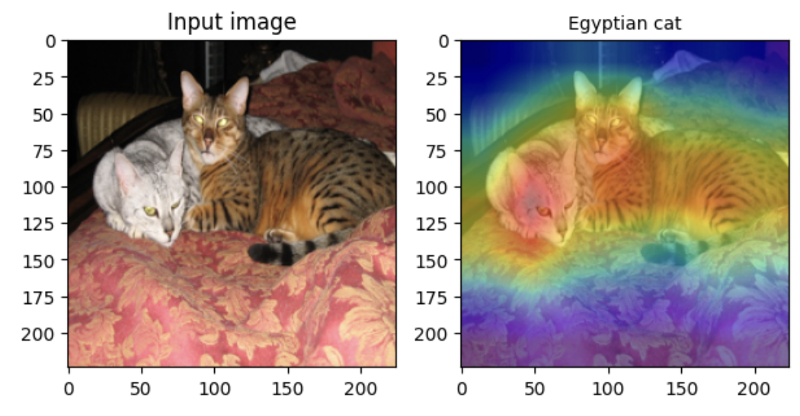

# practical-deep-learning
Collection of mini-projects implemented as part of the MVA course "Deep Learning in Practice", 2024.

## [Project 1: Grad-CAM](./GradCAM/)

[Grad-CAM: Visual Explanations from Deep Networks via Gradient-based Localization](https://arxiv.org/pdf/1610.02391.pdf)

The Grad-CAM algorithm is a technique for visualizing the regions of an image that are important for a CNN model's prediction. The goal of this project is to implement the Grad-CAM algorithm and apply it to a pre-trained model (here ResNet-34) on a subset of the ImageNet dataset.

