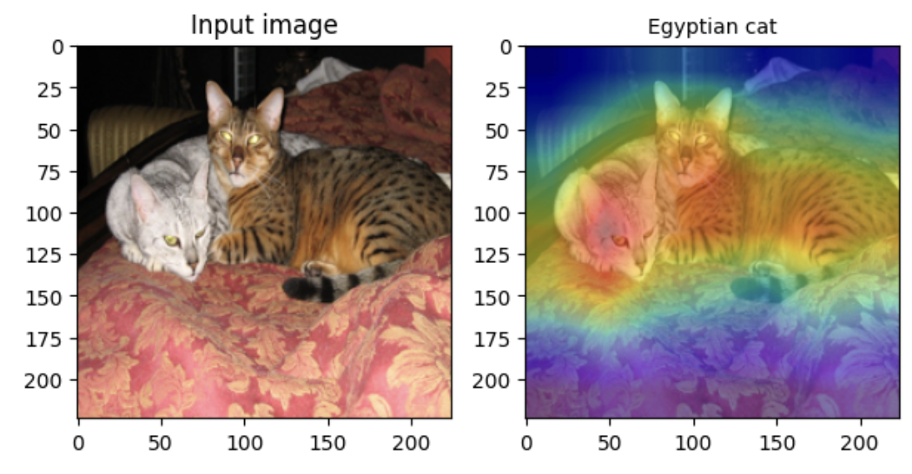
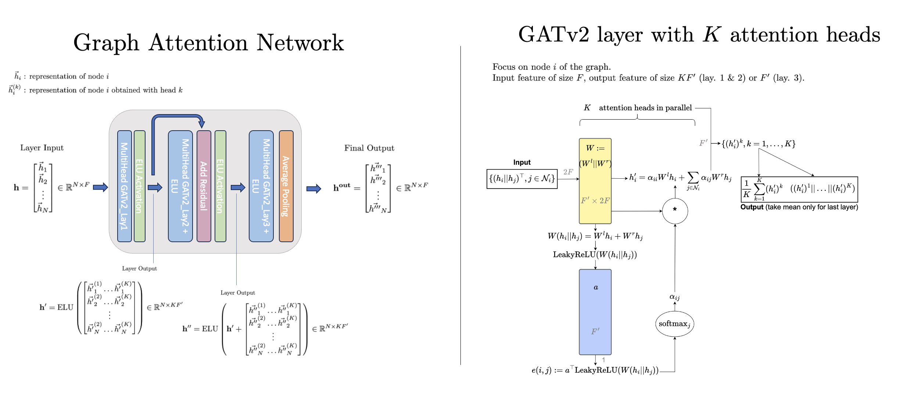

# practical-deep-learning
Collection of mini-projects implemented as part of the MVA course "Deep Learning in Practice", 2024.

## [Project 1: Grad-CAM](./1_GradCAM/)

[Grad-CAM: Visual Explanations from Deep Networks via Gradient-based Localization (Selvaraju et al. 2019)](https://arxiv.org/pdf/1610.02391.pdf) 

The Grad-CAM algorithm is a technique for visualizing the regions of an image that are important for a CNN model's prediction. The goal of this project is to implement the Grad-CAM algorithm and apply it to a pre-trained model (here ResNet-34) on a subset of the ImageNet dataset.

## [Project 2: Graph Attention Networks](./2_GATNetwork/)

[Graph Attention Networks (Veličković et al. 2017)](https://arxiv.org/pdf/1710.10903.pdf)

Inspired by the self-attention mechanism widely used (in Transformers for example), the Graph Attention Network uses a more flexible mechanism to learn the importance of each node's neighbors in the message-passing scheme as compared to then-existing architectures. The goal of this project is to implement a Graph Attention Network and compare its performance to Graph Convolutional Networks on the PPI (Protein-Protein Interaction) dataset for node classification.

